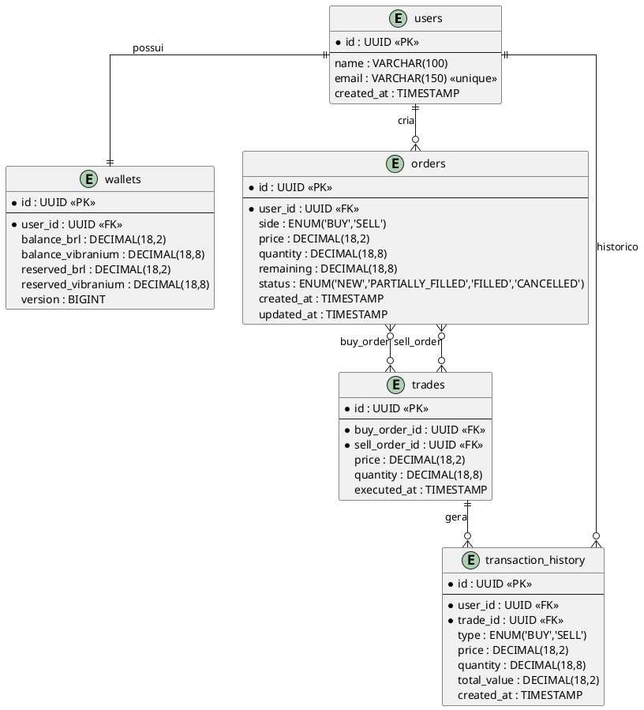
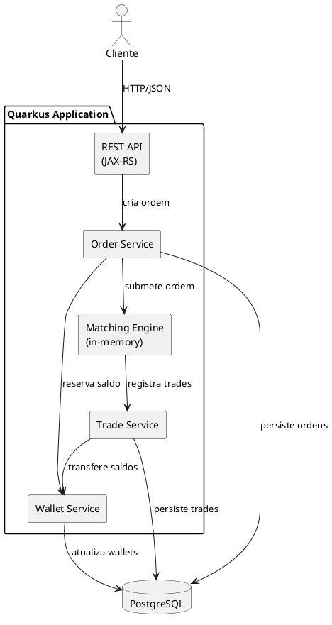
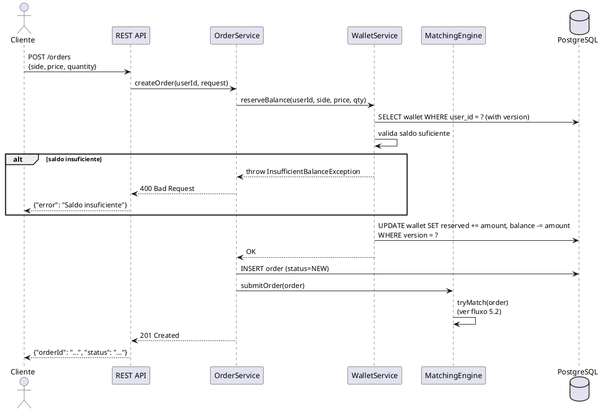
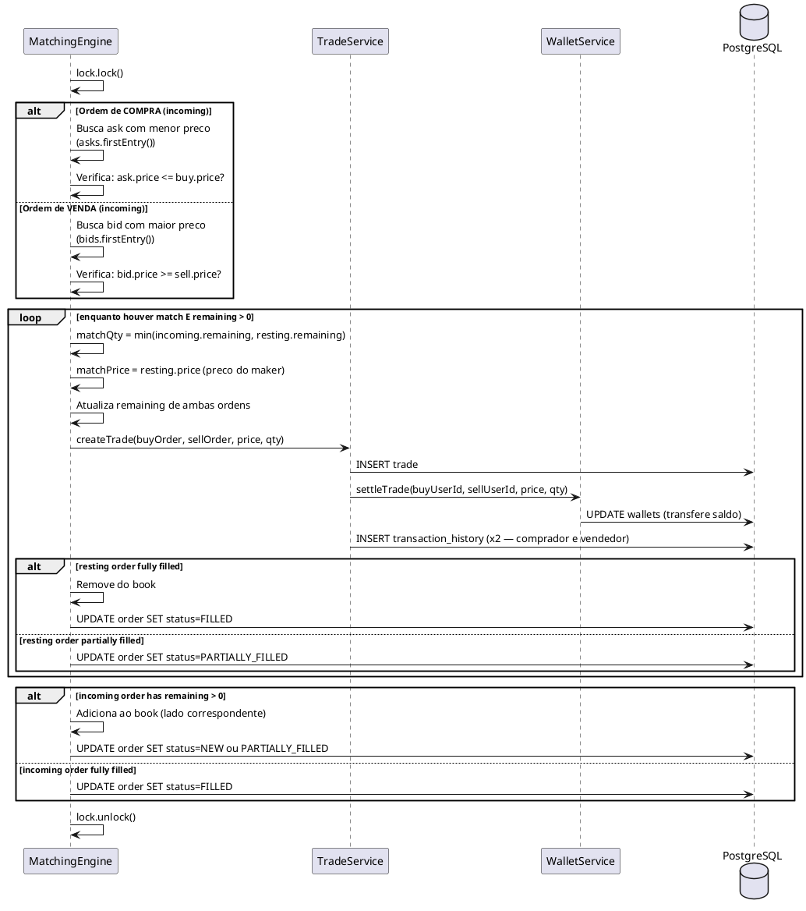
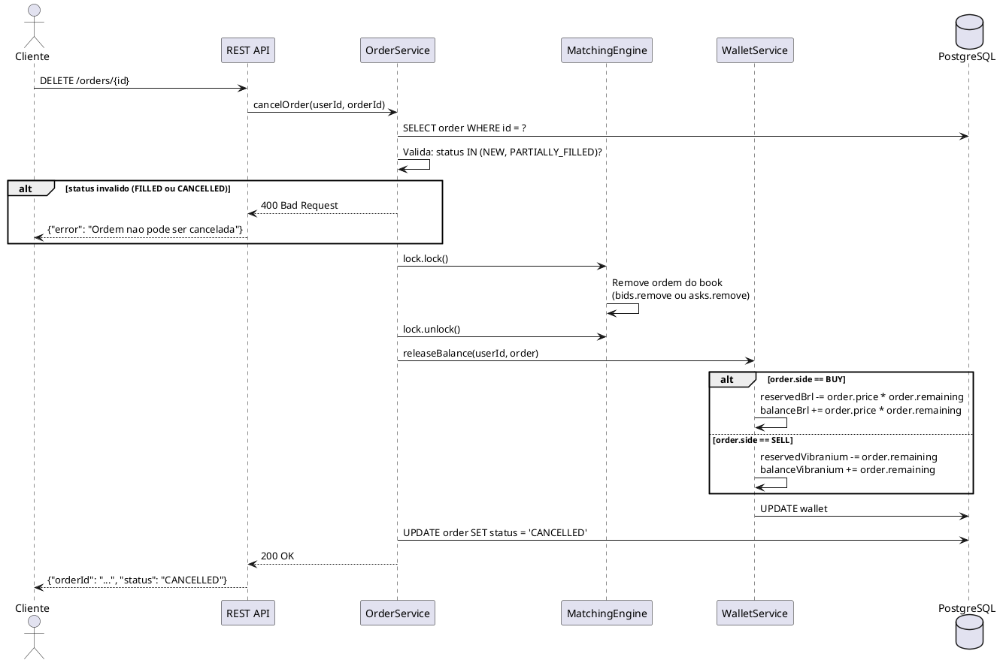
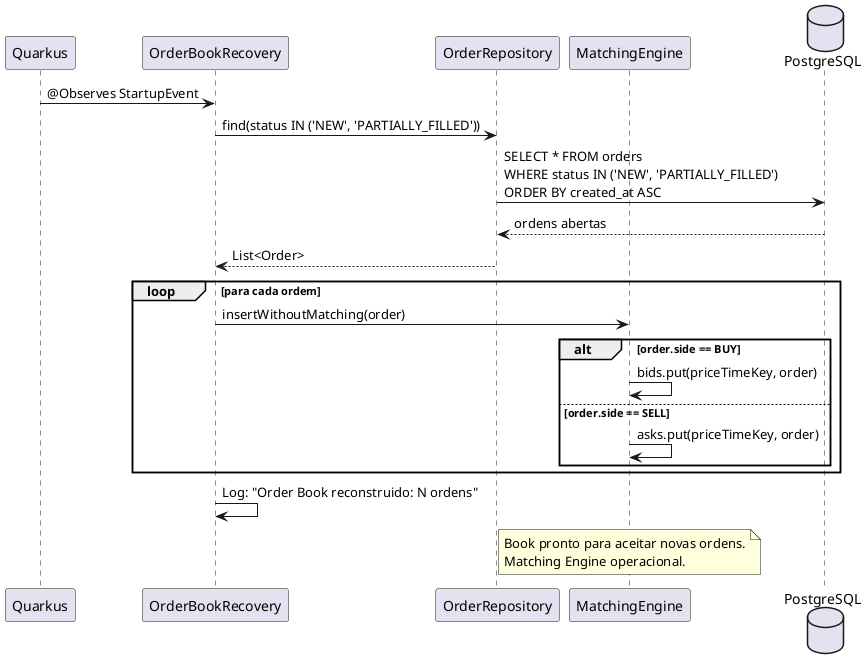

# Solucao — Order Book de Vibranium

## 1. Visao Geral do Desafio

Construir um **Order Book (Livro de Ofertas)** para negociacao de "Vibranium" em uma plataforma de e-commerce. Cada usuario possui uma **carteira (Wallet)** com saldo em Reais (BRL) e unidades de Vibranium. Usuarios podem colocar **ordens de compra (Buy)** e **ordens de venda (Sell)**. O sistema deve:

- Receber ordens de compra e venda via API REST
- Realizar o **matching** (casamento) automatico entre ordens compativeis
- Atualizar as carteiras dos usuarios envolvidos
- Manter historico completo de transacoes para rastreabilidade
- Escalar a aproximadamente **5.000 trades por segundo**

---

## 2. Conceitos Fundamentais

### 2.1 Order Book (Livro de Ofertas)

O Order Book e a estrutura central do sistema. Ele mantem duas listas ordenadas:

- **Bid Side (Lado de Compra):** ordens de compra ordenadas por preco **decrescente** (o maior preco no topo — quem paga mais tem prioridade)
- **Ask Side (Lado de Venda):** ordens de venda ordenadas por preco **crescente** (o menor preco no topo — quem vende mais barato tem prioridade)

Quando o **maior preco de compra >= menor preco de venda**, existe um match e um trade ocorre.

```
        ORDER BOOK - Vibranium/BRL

  COMPRA (Bids)          VENDA (Asks)
  ──────────────         ──────────────
  R$ 150,00 x 5  <--->  R$ 150,00 x 3   <- MATCH! Precos se cruzam
  R$ 149,50 x 10         R$ 151,00 x 8
  R$ 149,00 x 2          R$ 152,00 x 15
  R$ 148,00 x 7          R$ 155,00 x 4
```

### 2.2 Matching Engine (Motor de Correspondencia)

O Matching Engine e o componente que executa o algoritmo de casamento de ordens. Usa a regra **Price-Time Priority (Prioridade Preco-Tempo)**:

1. **Preco:** ordens com melhor preco sao executadas primeiro
2. **Tempo:** em caso de empate no preco, a ordem que chegou primeiro tem prioridade (FIFO)

O matching acontece de forma **sincrona** no momento em que uma nova ordem chega:

- Nova ordem de **compra** → tenta casar com as ordens de venda mais baratas
- Nova ordem de **venda** → tenta casar com as ordens de compra mais caras
- Uma ordem pode gerar **multiplos trades** (partial fills) ate ser completamente preenchida ou nao haver mais ordens compativeis

### 2.3 Ordens (Buy/Sell) — Limit Orders

Todas as ordens sao do tipo **Limit Order** (ordem limitada):

| Campo       | Descricao                                           |
|-------------|-----------------------------------------------------|
| `side`      | `BUY` ou `SELL`                                     |
| `price`     | Preco limite (maximo para compra, minimo para venda) |
| `quantity`  | Quantidade de Vibranium desejada                    |
| `remaining` | Quantidade ainda nao preenchida                     |
| `status`    | `NEW`, `PARTIALLY_FILLED`, `FILLED`, `CANCELLED`    |

**Regras de validacao ao criar uma ordem:**

- **Compra:** o usuario precisa ter saldo em BRL >= `price * quantity`
- **Venda:** o usuario precisa ter saldo em Vibranium >= `quantity`
- O saldo necessario e **reservado** (bloqueado) no momento da criacao da ordem

### 2.4 Trade (Execucao)

Um Trade e o registro de uma execucao entre duas ordens. Contem:

- Referencia a ordem de compra e a ordem de venda
- Preco de execucao (preco da ordem que ja estava no book — a "maker")
- Quantidade executada
- Timestamp

**Regra de preco:** o trade acontece no preco da ordem que ja estava no book (a ordem passiva/maker), nao no preco da ordem que acabou de chegar (a ordem agressora/taker).

### 2.5 Wallet (Carteira)

Cada usuario tem uma carteira com dois saldos:

| Campo               | Descricao                                    |
|---------------------|----------------------------------------------|
| `balanceBrl`        | Saldo disponivel em Reais                    |
| `balanceVibranium`  | Saldo disponivel em unidades de Vibranium    |
| `reservedBrl`       | Reais reservados em ordens de compra abertas |
| `reservedVibranium` | Vibranium reservado em ordens de venda abertas |

**Fluxo de saldo em um trade:**

```
Comprador:  reservedBrl      -= order.price * trade.quantity   (libera o total reservado para esta qty)
            balanceBrl       += (order.price - trade.price) * trade.quantity  (devolve excesso)
            balanceVibranium += trade.quantity

Vendedor:   reservedVibranium -= trade.quantity
            balanceBrl        += trade.price * trade.quantity
```

> **Nota sobre excesso de BRL:** Na criacao da ordem de compra, o sistema reserva `order.price * quantity`. Porem, o trade pode executar a um preco menor (preco do maker/vendedor). A diferenca `(order.price - trade.price) * trade.quantity` e devolvida ao `balanceBrl` do comprador. Exemplo: compra limitada a R\$155, executa a R\$150 — o excesso de R\$5 por unidade retorna ao saldo disponivel.

---

## 3. Modelo de Dados



**Notas sobre o modelo:**

- `wallets.version` usa **optimistic locking** para controle de concorrencia
- `DECIMAL(18,8)` para Vibranium permite alta precisao (ate 8 casas decimais)
- `remaining` na ordem rastreia o quanto falta preencher (partial fills)
- `transaction_history` e a tabela de rastreabilidade — cada lado de um trade gera uma entrada

**Indices recomendados:**

| Tabela                | Indice                                          | Justificativa                                      |
|-----------------------|-------------------------------------------------|----------------------------------------------------|
| `orders`              | `(user_id)`                                     | Consulta de ordens por usuario                     |
| `orders`              | `(status)`                                      | Reconstrucao do book (filtra NEW/PARTIALLY_FILLED) |
| `orders`              | `(side, status, price, created_at)`             | Consulta ordenada para matching e listagem         |
| `wallets`             | `(user_id)` UNIQUE                              | Lookup rapido; garante 1 wallet por usuario        |
| `trades`              | `(buy_order_id)`                                | Join de trades com ordens de compra                |
| `trades`              | `(sell_order_id)`                               | Join de trades com ordens de venda                 |
| `transaction_history` | `(user_id)`                                     | Historico de transacoes por usuario                |
| `transaction_history` | `(trade_id)`                                    | Lookup de historico por trade                      |

---

## 4. Arquitetura da Solucao

### 4.1 Visao Geral de Componentes



### 4.2 Detalhamento do Matching Engine (in-memory)

O Matching Engine e o coracao do sistema. Utiliza estruturas de dados concorrentes do Java:

```
Matching Engine
├── asks: ConcurrentSkipListMap<PriceTimeKey, Order>
│   └── ordenado por (price ASC, timestamp ASC)
├── bids: ConcurrentSkipListMap<PriceTimeKey, Order>
│   └── ordenado por (price DESC, timestamp ASC)
└── lock: ReentrantLock (por par de negociacao)
```

**Composicao da `PriceTimeKey`:**

A chave de ordenacao do `ConcurrentSkipListMap` e um objeto composto por tres campos:

```java
record PriceTimeKey(BigDecimal price, Instant timestamp, UUID orderId) {}
```

O `Comparator` define a prioridade em cada lado do book:

| Lado   | Ordenacao                                                              |
|--------|------------------------------------------------------------------------|
| **Asks** (venda) | `price ASC` → `timestamp ASC` → `orderId ASC` (menor preco primeiro) |
| **Bids** (compra) | `price DESC` → `timestamp ASC` → `orderId ASC` (maior preco primeiro) |

- **price:** garante que o melhor preco (menor para asks, maior para bids) fique no topo
- **timestamp:** em caso de empate no preco, a ordem mais antiga tem prioridade (FIFO)
- **orderId:** desempate final para ordens com mesmo preco e timestamp (garante ordenacao deterministica e evita colisoes na chave do map)

**Por que `ConcurrentSkipListMap`?**

| Alternativa     | Problema                                              |
|-----------------|-------------------------------------------------------|
| `TreeMap`       | Nao e thread-safe                                     |
| `PriorityQueue` | Nao permite remocao eficiente por chave               |
| `ConcurrentSkipListMap` | Thread-safe, O(log n) para insert/remove/lookup, ordenado |

**Por que um `ReentrantLock` adicional?**

O matching precisa ser **atomico**: ler o topo do book, verificar match, executar trade e atualizar ambas as ordens. Sem o lock, duas ordens chegando simultaneamente poderiam tentar casar com a mesma contraparte. O lock serializa apenas a operacao de matching — a persistencia no banco pode acontecer de forma assincrona.

### 4.3 Stack Tecnica

| Componente        | Tecnologia                       | Justificativa                          |
|-------------------|----------------------------------|----------------------------------------|
| Framework         | **Quarkus**                      | Startup rapido, baixo footprint, reativo |
| API               | **JAX-RS (RESTEasy Reactive)**   | Padrao Java, integrado ao Quarkus      |
| Banco de dados    | **PostgreSQL**                   | Robusto, ACID, suporte a DECIMAL       |
| ORM               | **Hibernate ORM + Panache**      | Simplifica acesso a dados no Quarkus   |
| Controle de concorrencia | **Optimistic Locking** (`@Version`) | Evita dead-locks nas wallets    |
| Matching Engine   | **ConcurrentSkipListMap + Lock** | Estrutura in-memory performatica       |
| Testes            | **JUnit 5 + RestAssured**        | Padrao para testes em Quarkus          |

---

## 5. Fluxos Principais

### 5.1 Criar uma Ordem



### 5.2 Matching e Execucao de Trade



### 5.3 Cancelamento de Ordem



**Detalhes do cancelamento:**

- **BUY:** libera `order.price * order.remaining` de `reservedBrl` de volta para `balanceBrl`
- **SELL:** libera `order.remaining` de `reservedVibranium` de volta para `balanceVibranium`
- Somente ordens com status `NEW` ou `PARTIALLY_FILLED` podem ser canceladas
- A remocao do book in-memory acontece **sob lock** para evitar que o matching tente casar uma ordem sendo cancelada
- O `remaining` ja reflete partial fills anteriores, entao o saldo liberado e sempre correto

---

## 6. Decisoes Tecnicas

### 6.1 Por que Matching in-memory? Persistencia sincrona vs. assincrona

O matching precisa ser **extremamente rapido** (meta: 5.000 trades/s). Se cada match dependesse de uma query ao banco, o throughput cairia drasticamente. A estrategia e:

1. O **Order Book vive em memoria** (ConcurrentSkipListMap)
2. O matching acontece **in-memory** sob lock
3. A **persistencia no banco** e feita de forma **sincrona** dentro do lock no MVP — prioriza **simplicidade e consistencia** (o banco e atualizado antes de liberar o lock, garantindo que o estado in-memory e o banco estao sempre alinhados)
4. Na inicializacao, o book e reconstruido a partir das ordens abertas no banco

**Analise de throughput — sincrono vs. assincrono:**

| Estrategia            | Throughput estimado     | Trade-off                                      |
|-----------------------|-------------------------|-------------------------------------------------|
| **Sincrona (MVP)**    | ~200–1.000 trades/s     | Simples, consistente, limitado pela latencia do banco (~1-5ms por write) |
| **Async/Batch**       | >5.000 trades/s         | Desacopla matching de I/O; requer write-ahead log ou outbox para garantir durabilidade |

> **Evolucao para 5.000 trades/s:** O MVP usa persistencia sincrona por simplicidade. Para atingir a meta de 5k trades/s, a evolucao natural e desacoplar a persistencia do matching: o lock libera apos o match in-memory, e os writes no banco sao feitos em **batch assincrono** (ex.: flush a cada 50ms ou a cada 100 trades). Isso requer um mecanismo de write-ahead log para garantir que trades nao sejam perdidos em caso de crash entre o match e o flush.

### 6.2 Por que Optimistic Locking na Wallet?

Duas ordens do mesmo usuario podem ser processadas concorrentemente. Sem controle:

```
Thread A: le saldo = R$100
Thread B: le saldo = R$100
Thread A: reserva R$80 → saldo = R$20 ✓
Thread B: reserva R$80 → saldo = R$20 ✓  ← ERRADO! Deveria falhar.
```

Com `@Version` (optimistic locking), o Thread B detecta que a versao mudou e faz retry.

### 6.3 Por que ReentrantLock no Matching Engine e nao synchronized?

- `ReentrantLock` permite **tryLock com timeout** — evita deadlocks
- Pode ser **fair** (FIFO) se necessario para garantir ordenacao
- Mais flexivel que `synchronized` para cenarios de matching complexos
- Para um unico par de negociacao (Vibranium/BRL), um lock global e suficiente e simples

### 6.4 Por que nao usar mensageria (Kafka, RabbitMQ)?

Para o MVP, mensageria adiciona complexidade desnecessaria:

- Um unico par de negociacao (Vibranium/BRL)
- Uma unica instancia do Quarkus e suficiente
- O lock do matching engine ja serializa o processamento
- Se no futuro houver multiplos pares ou necessidade de escalar horizontalmente, ai sim mensageria faz sentido

### 6.5 Reserva de Saldo no Momento da Criacao

O saldo e **reservado** (movido de `balance` para `reserved`) quando a ordem e criada, nao quando o trade acontece. Isso evita:

- Duplo gasto (usuario coloca duas ordens que somadas excedem o saldo)
- Race conditions no momento do matching
- Simplifica o fluxo de trade — o saldo ja esta "separado"

### 6.6 Autenticacao e Autorizacao

**MVP:** O `userId` e recebido via **header HTTP** (`X-User-Id`) ou como **path parameter** nos endpoints que exigem identificacao do usuario. Nao ha autenticacao real no MVP — confia-se que o chamador informa o userId correto.

**Evolucao:** Implementar autenticacao via **JWT (Bearer token)**:

```
Authorization: Bearer <jwt-token>
```

O `userId` e extraido do claim `sub` do token JWT, eliminando a necessidade de enviar o userId explicitamente. O Quarkus possui integracao nativa com MicroProfile JWT (`quarkus-smallrye-jwt`).

**Autorizacao:** Independente do mecanismo de autenticacao, o sistema deve garantir que:

- Um usuario so pode **criar ordens** usando sua propria wallet
- Um usuario so pode **cancelar** suas proprias ordens
- Um usuario so pode **consultar** sua propria wallet e historico de transacoes
- O **order book** e os **trades** sao informacoes publicas (leitura sem restricao)

---

## 7. Endpoints da API

| Metodo | Endpoint               | Descricao                              |
|--------|------------------------|----------------------------------------|
| POST   | `/api/users`           | Criar usuario com wallet               |
| GET    | `/api/users/{id}/wallet` | Consultar saldo da carteira          |
| POST   | `/api/orders`          | Criar ordem de compra ou venda         |
| GET    | `/api/orders/{id}`     | Consultar status de uma ordem          |
| DELETE | `/api/orders/{id}`     | Cancelar ordem aberta (libera saldo)   |
| GET    | `/api/orderbook`       | Visualizar o livro de ofertas atual    |
| GET    | `/api/trades`          | Listar trades executados               |
| GET    | `/api/users/{id}/transactions` | Historico de transacoes do usuario |

**Paginacao:** Os endpoints GET de listagem (`/api/trades`, `/api/users/{id}/transactions`, `/api/orders`) suportam paginacao via query parameters:

```
GET /api/trades?page=0&size=20
```

| Parametro | Default | Descricao                        |
|-----------|---------|----------------------------------|
| `page`    | `0`     | Numero da pagina (zero-indexed)  |
| `size`    | `20`    | Quantidade de itens por pagina   |

**Formato da resposta paginada:**

```json
{
  "content": [ ... ],
  "page": 0,
  "size": 20,
  "totalElements": 142,
  "totalPages": 8
}
```

---

## 8. Resiliencia e Tolerancia a Falhas

O Matching Engine vive **in-memory** — se o processo cair, o Order Book some da memoria. Esta secao descreve como a arquitetura garante que **nenhum dado e perdido** e o sistema se recupera de forma consistente.

**Principio fundamental:** o PostgreSQL e a **fonte da verdade**. O Order Book in-memory e apenas um **cache reconstruivel** a partir do banco.

### 8.1 Reconstrucao do Order Book no Startup

Na inicializacao da aplicacao, o Quarkus reconstroi automaticamente o Order Book a partir do banco de dados:

```java
@ApplicationScoped
public class OrderBookRecovery {

    @Inject MatchingEngine engine;
    @Inject OrderRepository orderRepository;

    void onStartup(@Observes StartupEvent ev) {
        List<Order> openOrders = orderRepository
            .find("status IN ('NEW', 'PARTIALLY_FILLED')")
            .list();

        for (Order order : openOrders) {
            engine.insertWithoutMatching(order);
            // Insere no lado correto (bids/asks) sem disparar matching
        }

        Log.infof("Order Book reconstruido: %d ordens carregadas", openOrders.size());
    }
}
```

**Pontos importantes:**

- Usa `insertWithoutMatching` — as ordens sao inseridas no book **sem disparar novo matching**, pois ja foram processadas anteriormente
- Ordens com `status = FILLED` ou `CANCELLED` **nao** sao carregadas — ja foram concluidas
- O `remaining` de cada ordem ja reflete o estado correto (partial fills anteriores)
- A ordem de insercao respeita o `created_at` original para manter a prioridade **Price-Time**
- **Apos a reconstrucao, executar um ciclo de matching** para casar ordens que ficaram pendentes. Isso cobre o cenario em que uma ordem foi inserida no banco (status `NEW`) mas o processo caiu **antes** de o matching engine processar o casamento. Sem esse ciclo, duas ordens compativeis poderiam ficar paradas no book sem nunca serem casadas:

```java
// Apos reconstruir o book
Log.info("Executando ciclo de re-matching pos-recovery...");
engine.runRecoveryMatching();
// Percorre o book e tenta casar ordens pendentes
```



### 8.2 Transacoes Atomicas no Banco

O trade, a atualizacao das wallets e a atualizacao do status das ordens **acontecem dentro de uma unica transacao** no banco. Isso garante que **nao existe estado "meio executado"**:

```java
@Transactional
public Trade settleTrade(Order buyOrder, Order sellOrder,
                         BigDecimal price, BigDecimal quantity) {
    // 1. Cria o trade
    Trade trade = new Trade(buyOrder, sellOrder, price, quantity);
    trade.persist();

    // 2. Atualiza as ordens
    buyOrder.remaining = buyOrder.remaining.subtract(quantity);
    buyOrder.status = buyOrder.remaining.signum() == 0 ? FILLED : PARTIALLY_FILLED;

    sellOrder.remaining = sellOrder.remaining.subtract(quantity);
    sellOrder.status = sellOrder.remaining.signum() == 0 ? FILLED : PARTIALLY_FILLED;

    // 3. Transfere saldos nas wallets
    Wallet buyerWallet = walletRepository.findByUserId(buyOrder.userId);

    // Calcula e devolve excesso de BRL (ordem pode ter sido reservada a preco maior que o trade)
    BigDecimal reservedPerUnit = buyOrder.price;
    BigDecimal excessBrl = reservedPerUnit.subtract(price).multiply(quantity);

    buyerWallet.reservedBrl = buyerWallet.reservedBrl.subtract(reservedPerUnit.multiply(quantity));
    buyerWallet.balanceBrl = buyerWallet.balanceBrl.add(excessBrl);
    buyerWallet.balanceVibranium = buyerWallet.balanceVibranium.add(quantity);

    Wallet sellerWallet = walletRepository.findByUserId(sellOrder.userId);
    sellerWallet.reservedVibranium = sellerWallet.reservedVibranium.subtract(quantity);
    sellerWallet.balanceBrl = sellerWallet.balanceBrl.add(price.multiply(quantity));

    // 4. Registra historico
    createTransactionHistory(buyOrder.userId, trade, "BUY");
    createTransactionHistory(sellOrder.userId, trade, "SELL");

    // Se QUALQUER etapa falhar → rollback automatico de TUDO
    return trade;
}
```

**Fluxo real do matching com atomicidade:**

```
1. MatchingEngine (in-memory) decide o match sob lock
2. Abre @Transactional no banco
3. Persiste trade + atualiza ordens + transfere wallets → COMMIT
4. Se falhou no passo 3:
   → Banco faz ROLLBACK (estado do banco intacto)
   → MatchingEngine desfaz as alteracoes no book in-memory
   → Ordem volta ao estado anterior
```

**Cenario de falha: crash entre match in-memory e persistencia:**

Se a aplicacao cair **depois** do match in-memory mas **antes** do commit no banco, nao ha problema — o banco nunca recebeu a transacao. No restart, as ordens serao recarregadas com seu estado original e o matching acontecera novamente.

### 8.3 Idempotencia

Para garantir que retries nao causem duplicatas:

- **Ordens** possuem UUID gerado antes do matching. Se o cliente fizer retry de uma criacao de ordem, pode enviar o mesmo UUID — o banco rejeita pela constraint de `PRIMARY KEY`
- **Trades** referenciam o par `(buy_order_id, sell_order_id, price, quantity)`. Uma constraint `UNIQUE` sobre `(buy_order_id, sell_order_id)` impede que o mesmo par de ordens gere trades duplicados
- Isso permite **retry seguro** em caso de timeout na resposta HTTP — a operacao ou ja foi executada (e o retry falha silenciosamente) ou nao foi (e o retry executa normalmente)

### 8.4 Graceful Shutdown

Quando a aplicacao recebe sinal de desligamento (SIGTERM), o Quarkus executa o shutdown de forma ordenada:

```java
@ApplicationScoped
public class OrderBookShutdown {

    @Inject MatchingEngine engine;

    void onShutdown(@Observes ShutdownEvent ev) {
        Log.info("Shutdown iniciado — parando de aceitar novas ordens...");

        // 1. Para de aceitar novas ordens
        engine.stopAcceptingOrders();

        // 2. Aguarda operacoes in-flight terminarem (com timeout)
        engine.drainInFlightOperations(Duration.ofSeconds(10));

        Log.info("Shutdown completo — book sera reconstruido no proximo startup.");
        // O book NÃO precisa ser serializado — sera reconstruido a partir do banco
    }
}
```

**Por que nao serializar o book no shutdown?**

- O banco **ja tem** todas as ordens abertas com estado atualizado
- Serializar seria redundante e introduziria risco de inconsistencia (book serializado vs. banco)
- Reconstruir a partir do banco e simples, seguro e garante consistencia

### 8.5 Health Checks

O Quarkus SmallRye Health fornece endpoints padrao para monitoramento:

```java
@Readiness
@ApplicationScoped
public class OrderBookReadinessCheck implements HealthCheck {
    @Inject MatchingEngine engine;

    @Override
    public HealthCheckResponse call() {
        return HealthCheckResponseBuilder.named("order-book")
            .status(engine.isReady())       // book reconstruido?
            .withData("orders_loaded", engine.getOrderCount())
            .build();
    }
}

@Liveness
@ApplicationScoped
public class OrderBookLivenessCheck implements HealthCheck {
    @Inject MatchingEngine engine;

    @Override
    public HealthCheckResponse call() {
        return HealthCheckResponseBuilder.named("matching-engine")
            .status(engine.isResponding())  // engine respondendo?
            .build();
    }
}
```

| Endpoint            | Tipo       | O que verifica                                        |
|---------------------|------------|-------------------------------------------------------|
| `/q/health/ready`   | Readiness  | Banco acessivel + Order Book reconstruido             |
| `/q/health/live`    | Liveness   | Processo vivo + Matching Engine respondendo           |

- **Readiness** = "estou pronto para receber trafego" — retorna `DOWN` enquanto o book esta sendo reconstruido no startup
- **Liveness** = "estou vivo e funcionando" — se retornar `DOWN`, o orquestrador (Kubernetes, etc.) reinicia o container

### 8.6 Resumo dos Cenarios de Falha

| Cenario                                   | O que acontece                                          | Garantia                              |
|-------------------------------------------|---------------------------------------------------------|---------------------------------------|
| Crash com ordens abertas no book          | Ordens permanecem no banco com status correto           | Reconstrucao + re-matching no startup (8.1) |
| Crash entre insercao da ordem e matching  | Ordem no banco mas nunca casada → re-matching resolve   | Ciclo de re-matching pos-recovery (8.1) |
| Crash entre match in-memory e commit      | Banco nunca recebeu a transacao → sem efeito            | Transacao atomica (8.2)               |
| Crash apos commit parcial (impossivel)    | `@Transactional` garante tudo-ou-nada                   | Atomicidade ACID (8.2)               |
| Timeout no cliente apos envio de ordem    | Cliente faz retry → idempotencia impede duplicata       | UUID + constraints (8.3)              |
| Saldo reservado mas trade nao completou   | Rollback devolve o estado da wallet                     | Transacao atomica (8.2)               |
| Restart limpo (deploy/upgrade)            | Graceful shutdown drena in-flight + reconstrucao        | Shutdown (8.4) + Startup (8.1)        |
| Orquestrador precisa saber se esta pronto | Health checks reportam estado real                      | SmallRye Health (8.5)                 |

---

## 9. Verificacao e Testes

### Cenarios essenciais para validar a solucao:

1. **Ordem sem match:** criar ordem de compra sem vendedores → ordem fica no book com status `NEW`
2. **Match exato:** compra 10 a R$150 + venda 10 a R$150 → trade de 10 a R$150, ambas `FILLED`
3. **Match parcial:** compra 10 a R$150 + venda 3 a R$150 → trade de 3, compra fica `PARTIALLY_FILLED` com remaining=7
4. **Multiplos matches:** compra 10 a R$155 contra 3 vendas (3 a R$150 + 4 a R$152 + 5 a R$155) → 3 trades, compra `FILLED`
5. **Saldo insuficiente:** compra com saldo < price*qty → rejeitada com 400
6. **Cancelamento:** cancelar ordem aberta → saldo reservado retorna para disponivel
7. **Concorrencia:** 100 compras e 100 vendas simultaneas → nenhum saldo negativo, todos os trades consistentes
8. **Preco de execucao:** trade sempre executa no preco da ordem maker (a que ja estava no book)

### Como executar:

```bash
# Subir o banco
docker-compose up -d postgres

# Rodar testes
./mvnw test

# Rodar a aplicacao
./mvnw quarkus:dev

# Teste manual — criar usuario
curl -X POST http://localhost:8080/api/users \
  -H "Content-Type: application/json" \
  -d '{"name": "Wakandiano", "email": "wakanda@example.com"}'

# Teste manual — criar ordem de compra
curl -X POST http://localhost:8080/api/orders \
  -H "Content-Type: application/json" \
  -d '{"userId": "<UUID>", "side": "BUY", "price": 150.00, "quantity": 10}'
```
